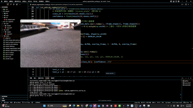

# 車牌辨識 (LPR) 專案 - 使用 YOLOv11 實例分割




## 資料夾結構

```
lpr-model/
├── dataset/
│   ├── train/
│   │   ├── images/     # 訓練用圖片
│   │   └── labels/     # 訓練用 YOLO 格式標籤 (.txt)
│   ├── val/
│   │   ├── images/     # 驗證用圖片
│   │   └── labels/     # 驗證用 YOLO 格式標籤 (.txt)
│   └── test/           # (可選) 測試用圖片和標籤
│       ├── images/
│       └── labels/
│   └── lpr_dataset.yaml  # YOLO 資料集設定檔
├── runs/
│   └── segment/
│       └── trainX/       # 訓練輸出 (模型權重、日誌、結果圖等)
│           └── weights/
│               ├── best.pt # 最佳模型權重
│               └── last.pt # 最新模型權重
├── .venv/                # (建議) Python 虛擬環境
├── rename_labels.py      # (舊) 用於初始重命名原始標籤的腳本
├── organize_yolo_labels.py # (舊) 用於整理標籤到 images/labels 結構的腳本
├── check_image_label_pairs.py # 用於檢查圖片與標籤是否配對的腳本
├── validate_segmentation_labels.py # 用於驗證標籤內容格式的腳本
├── inspect_polygon_properties.py # 用於檢查標籤多邊形幾何屬性的腳本
├── webcam_segmentation_overlay.py # 即時攝影機分割展示腳本
├── README.md             # 本檔案
└── ...                   # 其他可能的設定檔或腳本
```

## 安裝步驟

1.  **建立 Python 虛擬環境 (建議)**:
    *   建議使用 Python 3.10 - 3.12 版本。
    *   如果您使用 `uv` (推薦):
        ```bash
        uv venv .venv --python 3.12  # 替換為您希望的 Python 版本
        source .venv/bin/activate  # Linux/macOS
        # 或者 .venv\Scripts\activate # Windows Powershell
        # 或者 uvx ... 直接在虛擬環境中執行指令
        ```
    *   或者使用內建 `venv`:
        ```bash
        python -m venv .venv
        source .venv/bin/activate  # Linux/macOS
        # 或者 .venv\Scripts\activate # Windows Powershell
        ```

2.  **安裝必要的 Python 套件**:
    在啟動的虛擬環境中執行：
    ```bash
    pip install ultralytics opencv-python numpy torch torchvision torchaudio
    # 如果需要匯出為 TFLite，還需要 TensorFlow:
    pip install tensorflow
    # 如果匯出時遇到 ONNX 相關問題，可能需要手動安裝:
    pip install onnx onnxruntime onnx-tf onnxslim # (onnx-tf 和 onnxslim 可能視情況需要)
    ```
    或者，如果您使用 `uv`:
    ```bash
    uv pip install ultralytics opencv-python numpy torch torchvision torchaudio
    uv pip install tensorflow
    uv pip install onnx onnxruntime onnx-tf onnxslim
    ```
    *注意*: `torch`, `torchvision`, `torchaudio` 的安裝可能因您的作業系統和是否需要 CUDA 支援而異。請參考 [PyTorch 官方網站](https://pytorch.org/get-started/locally/) 獲取最適合您環境的安裝指令。

## 資料準備

本專案使用的原始資料集可以從以下連結下載：
[LPR Dataset on Google Drive](https://drive.google.com/file/d/1PNGVOtodE6Y6aNITxY5RaNoTgt2FzFXX/view?usp=drive_link)

下載後，請依照以下步驟進行處理與組織：

1.  **收集影像**: (此步驟已由上述資料集提供)
2.  **標註資料**:
    *   使用標註工具 (如 Label Studio, LabelImg 等) 對車牌區域進行**多邊形分割 (segmentation polygons)** 標註。
    *   確保您的類別只有一個，例如 "license_plate"，其類別索引為 `0`。
3.  **匯出標籤**:
    *   將標註匯出為 **YOLO TXT 格式**。每一行代表一個物件，格式通常是 `class_index x1 y1 x2 y2 x3 y3 ... xN yN` (正規化座標)。
4.  **組織資料夾**:
    *   依照上述「資料夾結構」一節的說明，將圖片和對應的 `.txt` 標籤檔案分別放入 `dataset/train/images/`, `dataset/train/labels/`, `dataset/val/images/`, `dataset/val/labels/` 等目錄中。
    *   確保每個圖片檔案 (如 `image1.jpg`) 在對應的 `labels` 資料夾中都有一個同名的標籤檔案 (如 `image1.txt`)。
5.  **建立 `lpr_dataset.yaml`**:
    在 `dataset/` 目錄下建立 `lpr_dataset.yaml` 檔案，內容如下 (路徑是相對於此 YAML 檔案的位置)：
    ```yaml
    path: . # 指向 dataset 目錄本身，或者使用絕對路徑
    train: train/images/
    val: val/images/
    # test: test/images/  # 如果有測試集

    # Classes
    names:
      0: license_plate
    ```

## 模型訓練

在專案根目錄下，並確保虛擬環境已啟動，執行以下指令開始訓練：

```bash
yolo segment train data=dataset/lpr_dataset.yaml model=yolo11n-seg.pt epochs=100 imgsz=640
```

*   `data`: 指向您的資料集設定檔。
*   `model`: 使用的預訓練模型 (例如 `yolo11n-seg.pt`, `yolo11s-seg.pt` 等)。腳本會自動下載。
*   `epochs`: 訓練的輪次。
*   `imgsz`: 訓練時輸入圖片的尺寸。

訓練完成後，最佳模型會保存在 `runs/segment/trainX/weights/best.pt`。

## 模型匯出 (例如 TFLite)

將訓練好的 PyTorch 模型 (`.pt`) 匯出為適合邊緣裝置的格式，例如 TFLite：

```bash
yolo export model=runs/segment/trainX/weights/best.pt format=tflite imgsz=640
```
(請將 `trainX` 替換為您實際的訓練輸出檔案夾名稱)

這會在 `runs/segment/trainX/weights/` 目錄下生成 `best_float32.tflite` (或類似名稱) 的檔案。

## 即時辨識 (Webcam Overlay)

使用 `webcam_segmentation_overlay.py` 腳本可以開啟網路攝影機，並對偵測到的車牌區域進行即時分割和顏色疊加。

1.  **修改模型路徑**: 打開 `webcam_segmentation_overlay.py`，找到 `MODEL_PATH` 變數，將其值修改為您要使用的模型檔案路徑 (例如訓練好的 `best.pt`，或匯出的 `.tflite` / `.onnx` 模型路徑，但腳本目前預設載入 `.pt` 模型，如需載入其他格式需修改載入邏輯)。
2.  **執行腳本**:
    ```bash
    python webcam_segmentation_overlay.py
    ```
    按 'q' 鍵退出。


## 授權 (License)

本專案中的程式碼 (Python 腳本等) 採用 [MIT 授權](LICENSE) 條款。

本專案提供的車牌資料集 (`dataset/`) 採用 [Creative Commons Attribution-NonCommercial 4.0 International (CC BY-NC 4.0) 授權](dataset/LICENSE) 條款。這意味著您可以出於非商業目的自由使用、分享和修改此資料集，但必須註明出處。任何商業用途均需另行協商。
